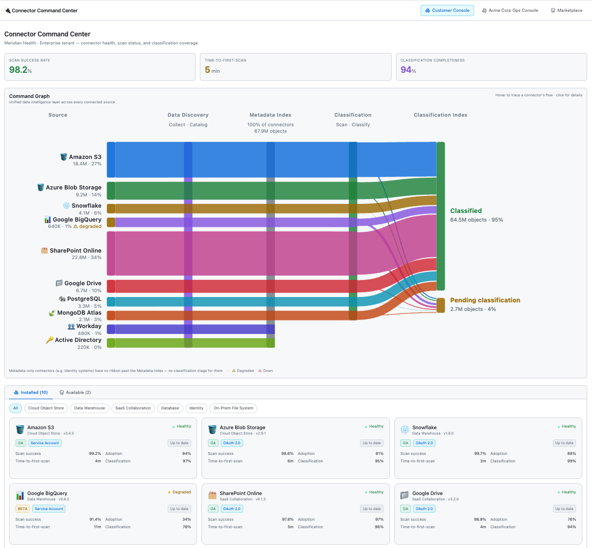
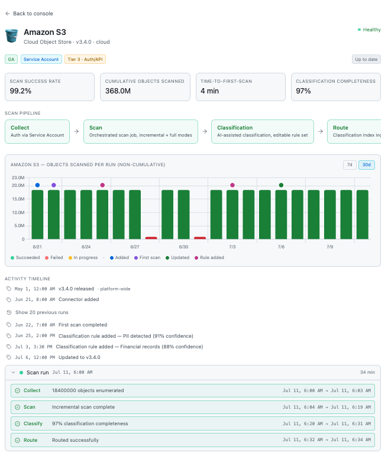
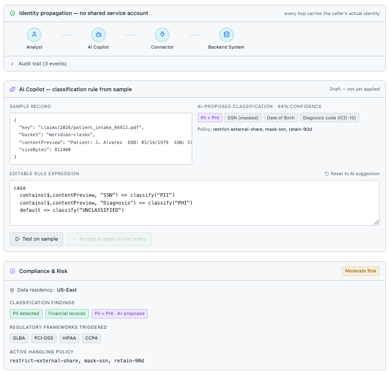
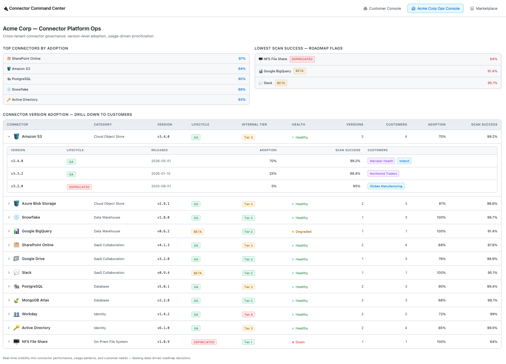
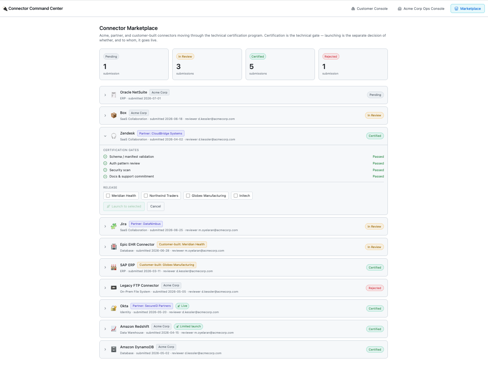

# Connector Command Center

*A product thinking exercise, not a production application.*

After exploring large-scale connector ecosystems, I wanted to work through one question: if I were the PM responsible for hundreds connectors, what operating model would I build?

The result is a prototype that demonstrates product strategy — the implementation is a vehicle for the thinking.

---

## The Problem

The failure mode for connector ecosystems at scale is **every connector becoming its own engineering project**.

Connectors aren't features. They're products — each with its own lifecycle, auth model, versioning story, and maintenance cost. A library of hundreds connectors built by different teams at different times will drift into inconsistency unless the platform team builds deliberate governance around it. This prototype explores what that governance looks like.

---

## Product Principles

1. **Every connector is a product with a lifecycle** — alpha → beta → GA → deprecated, with explicit gates between stages
2. **Standardize what's common, specialize what's specific** — auth, observability, retry handling, and certification belong in the framework layer; source-specific parsing belongs in the connector
3. **Product teams shouldn't rebuild infrastructure repeatedly** — a new connector should cost one sprint, not three
4. **Customers should understand connector health without opening a support ticket** — observability is a customer experience problem, not just an engineering one
5. **Connector quality is measured by outcomes, not connector count** — scan success rate, time-to-first-scan, and classification completeness matter more than the number in the catalog

---

## The Platform Model

```
External Systems
(databases · SaaS apps · cloud storage · on-prem file systems · identity providers)
        │
        ▼
┌──────────────────────────────────────┐
│          Connector Framework         │
│                                      │
│  ├─ Authentication & Auth Patterns   │
│  ├─ Retry & Back-pressure Handling   │
│  ├─ Schema Mapping & Normalization   │
│  ├─ Observability & Health Metrics   │
│  ├─ Versioning & Lifecycle Stages    │
│  ├─ Certification Pipeline           │
│  └─ Staged Rollout & Release Gates   │
└──────────────────────────────────────┘
        │
        ▼
Command Graph
(Security · Governance · Compliance · Privacy · Resilience)
```

---

## Key Design Decision: 4-Tier Connector Classification

The most important architectural choice in the prototype governs **release cadence by type of change**:

| Tier | Change Type | Cadence | Risk |
|------|-------------|---------|------|
| Tier 1 | Parser-only | Weekly | Low |
| Tier 2 | Schema change | Bi-weekly | Low |
| Tier 3 | Auth / API change | Monthly | Medium |
| Tier 4 | Framework-level | Quarterly | High |

Treating all connector updates as equivalent creates hidden coupling. A trivial parser fix and a framework-level refactor queued in the same monthly cycle means the parser fix waits — and customers feel it. The tier model decouples update frequency from update risk: high-frequency, low-risk changes ship fast; framework changes that touch every downstream pipeline get full regression coverage.

---

## Three Views

### 1. Customer Console

The view a tenant admin sees — scoped entirely to their own data pipeline. No cross-tenant exposure.

- **KPI header:** scan success rate, time-to-first-scan, and classification completeness — the metrics that tell you whether the connector layer is *working*, not just *running*
- **DataFlow Sankey:** Source → Data Discovery → Metadata Index → Classification → Classification Index, made visible rather than implicit
- **Connector detail:** per-connector pipeline stage view, run history, AI-assisted classification findings, regulatory framework mapping (HIPAA, GDPR, CCPA, PCI-DSS, GLBA, PDPA), and activity timeline







### 2. Ops Console

The internal view a connector PM or release engineer works from.

- **Version-per-tenant tracking:** Enterprise customers don't upgrade simultaneously. Without version visibility, support triage, release planning, and deprecation become guesswork. This view answers "which customers are on which version" as a first-class question.
- **4-tier cert tier per connector:** visible at a glance, directly drives release cadence
- **Health and adoption per version:** a connector where 30% of eligible customers are on the latest version is a maintenance story, not a success story



### 3. Marketplace

Full lifecycle of a connector submission from intake to GA — for first-party, partner, and customer-built connectors.

- **Certification gates:** schema validation, auth compliance, security review, documentation completeness — required before any connector can be launched
- **Certification ≠ launch:** a connector can pass all gates and still sit unlaunched. Launch is a separate product decision, not an automatic consequence of passing review
- **Staged rollout:** launch to a subset of tenants first, observe, then expand to all — the same model used for any high-risk platform change



---

## What I Intentionally Did Not Build

**Excluded:**
- Authentication flows (modeled as patterns, not implemented)
- Backend services, scheduler, or retry engine
- Connector SDK or build tooling

**Focused on:**
- PM operating model and lifecycle governance
- Customer-facing observability and health
- Release, certification, and rollout workflows
- Platform architecture reasoning

The code isn't the interesting part. The product decisions are.

---

## Tech Stack

React + Vite + Tailwind. Data is CSV-backed under `public/data/` — no backend, no API keys.

```bash
npm install
npm run dev
```

---

*Inspired by challenges common to large-scale connector ecosystems · July 2026*

---

© 2026 Kousalya Naidu. All rights reserved.
Shared for portfolio and evaluation purposes only.
